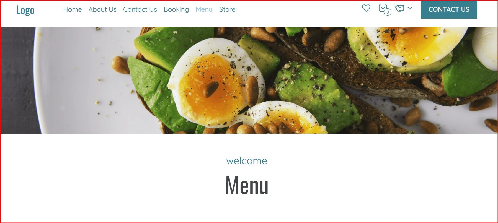
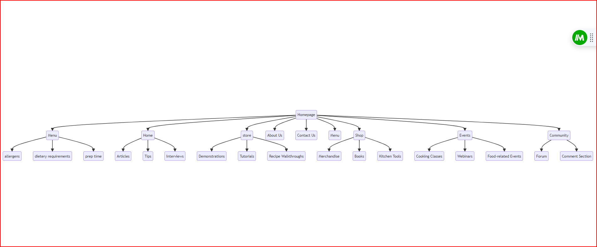

+++    
### Team Members
1. Aayan Rai
2. Benjamin Denison-Love
3. Juan Miguel Badayos
4. Muhammed Abed

### Project Brief
The team is tasked with creating a cooking website designed to boost user engagement and satisfaction. This will be achieved through an intuitive, personalized, and accessible culinary platform. The project aims to tackle the inefficiencies of the current platform which lacks robust filtering options and underutilizes user-generated content. Key focus areas include:

- Personalized recipe recommendations
- Mobile responsiveness
- High-quality multimedia content
- Advanced filtering options (e.g., preparation time, allergens, dietary needs, cooking skills)

+++
### Component DEsign
# MVP

## Information Architecture

The architecture outlines the structure of the website, including sections such as:

- **Menu:** Allergens, Dietary Requirements, Prep Time
- **Home:** Articles, Tips, Interviews, Demonstrations, Tutorials, Recipe Walkthroughs
- **Store:** Merchandise, Books, Kitchen Tools, Cooking Classes
- **Events:** Webinars, Food-related Events
- **Community:** Forum, Comment Section
+++
