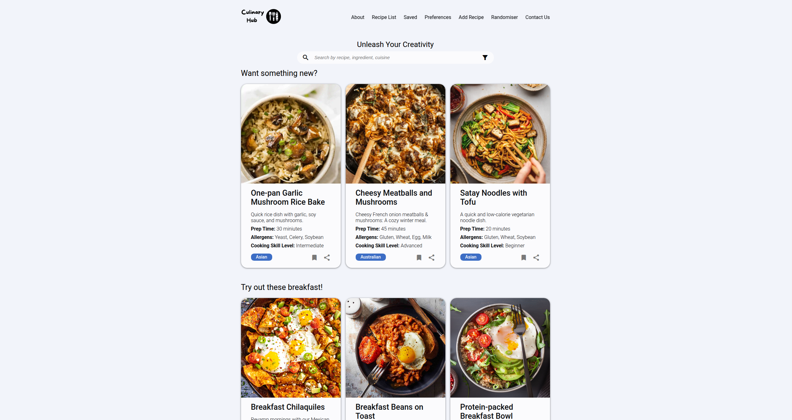

# School Project

This website was initially committed on [Bitbucket](https://group-16-hit226.bitbucket.io/).

## Project Brief

This website aims to create a responsive and visually appealing cooking website 
that provides recipes, cooking tips, and any additional information and relevant
information about the team and how to contact them within the site. The project
aims to target home cooks, food enthusiasts, or simply individuals seeking
culinary inspiration on matters of recipes they are unfamiliar with. The website
also offers the following features:

1. Easy navigation and search functionality for finding recipes quickly.
2. Personalized recipe recommendations based on user preferences and dietary restrictions.
3. Mobile responsiveness for seamless across devices.
4. High-quality multimedia content, including images and step-by-step instructions.

HTML, CSS, and JavaScript will be the main building blocks for our website, 
ensuring a seamless and user-friendly interface for the users and compatibility
across browsers and mobile devices. Each team member will run the website 
independently on private computers to identify faults before pushing them to the
primary repository.

Team members will utilize Microsoft Teams and Bitbucket for effective feedback 
on changes and errors encountered while testing or found afterwards. Moreover, 
all team members will contribute equally to design, content creation, and code 
development. The team also plans to meet semi-weekly when needed and communicate
via teams for any further updates.

## Screenshots

 
